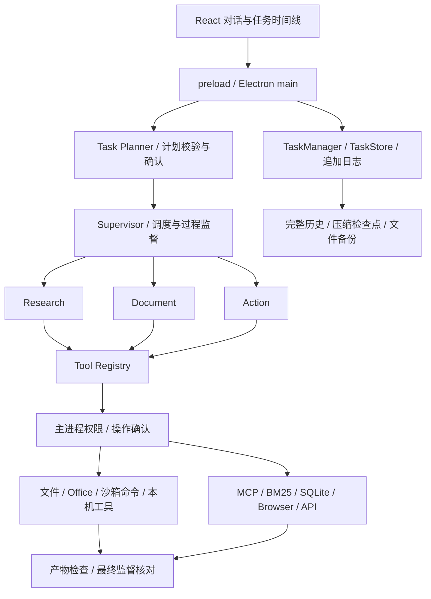

# 架构与代码结构

## 运行链路

Electron 主进程持有配置、任务、模型连接和工具权限。React 通过受限 preload/IPC 调用它，renderer 不直接接触密钥、Node.js 或文件系统。模型循环使用 Pi Agent。

直接执行沿用单代理流程；分工执行先校验依赖图，由 Supervisor 调度研究、文档和操作节点。每个节点有独立上下文，读取依赖成果前核对来源和产物。过程监督可以查看、定向消息、等待节点，或提出需要用户确认的新计划。默认最多修订两次；保留无须重做的节点，重建受影响的后续节点。



## 模块职责

| 位置 | 职责 |
| --- | --- |
| `src/App.tsx` | 对话、导航、输入、模型选择、需求检查和部分设置 |
| `src/TaskTimeline.tsx` | 步骤、用量、暂停恢复、diff 与撤销 |
| `src/RuntimeSettingsDialog.tsx`、`AgentPolicyPanel.tsx` | 验证、备份、数据状态、预算与模型能力 |
| `src/McpDialog.tsx`、`McpDiscovery.tsx`、`InputRequestDialog.tsx` | 服务管理、目录配置、MCP 表单 |
| `src/MemoryDialog.tsx`、`WorkspacePanel.tsx` | 记忆管理与文件/Git 预览 |
| `electron/main.js`、`preload.cjs`、`src/types.ts` | 生命周期、显式 IPC 契约、工具与页面适配 |
| `electron/model.js`、`model-capabilities.js`、`providers.js` | 模型协议、能力和各阶段选择 |
| `electron/runtime/workflow.js`、`task-planner.js`、`supervisor.js`、`plan-revision.js` | 分工、队列、依赖图、监督、修订 |
| `runtime.js`、`task-manager.js`、`task-store.js`、`task-journal.js`、`task-schema.js` | 持久状态、步骤、日志与恢复 |
| `conversation.js`、`context-manager.js` | 完整模型历史、上下文组织与语义压缩 |
| `usage-ledger.js`、`working-memory.js`、`experience-memory.js` | 预算、阶段成果与经验候选 |
| `tool-registry.js`、`tool-executor.js`、`resource-lock.js` | 工具契约、调用上下文与冲突资源排队 |
| `sandbox.js`、`process-sessions.js` | Seatbelt 策略、命令进程、输入/轮询/停止 |
| `checkpoint-manager.js`、`verification-engine.js`、`verification-config.js`、`backup-retention.js` | 备份、成果验证与清理 |
| `diagnostics.js` | 诊断导出字段白名单 |
| `electron/files.js`、`edit.js`、`office.js`、`native.js` | 文件、精确编辑、办公输出和 macOS 集成 |
| `knowledge.js`、`sql-query.js`、`sql-worker.js`、`browser-tool.js`、`registered-api.js` | BM25、只读 SQLite 子进程、隔离浏览器和 API |
| `mcp.js`、`mcp-services.js`、`mcp-oauth.js`、`mcp-registry.js` | MCP 连接、认证、OAuth 和服务检索 |
| `electron/vendor/sandbox-runtime/` | 固定版本的上游策略生成代码、许可和摘要 |
| `tests/` | 单元、Electron、协议与综合任务验收 |
| `scripts/` | macOS 打包与图标生成 |

表中省略 `electron/` 的普通工具文件位于该目录，运行时文件位于 `electron/runtime/`。内部包名、IPC 命名和 `.zhuge` 配置路径保留早期名称，以兼容已有本地数据。

## 上下文与并发

每个阶段保存完整历史、消息序列和语义压缩检查点。压缩保留用户原文约束、工具调用关联、未决问题和证据引用；恢复后重新声明当前规则和工具。摘要是工作资料，不能授予权限。压缩模型调用计入同一预算；摘要失败或保存失败时保留原历史。

上下文占用采用估算，包含系统规则和工具 schema，并受模型窗口和输出预留限制。用户限制本身超出窗口时停止，不静默删掉要求。模型能力目录是依赖版本的快照，未知模型采用保守限制。

调用身份通过 AsyncLocalStorage 绑定任务、节点、步骤与工具。文件确认后按路径提交，独立文件可以并发；命令与无法推断写入范围的操作独占工作目录。等待资源时可以取消。同一个 Agent 的工具循环仍串行，全局节点并发有限，不提供分布式调度。

命令会话支持增量输出、stdin、轮询与停止；采用 pipe，不提供 PTY。停止和超时结束进程组，命令改动不纳入文件工具 checkpoint。

## 持久数据

数据存放在 Electron `userData`，不在源码仓库中：

```text
userData/
  settings.json                 # 模型连接与界面设置
  agents.json                   # 自定义智能体
  memories.json                 # 偏好与项目事实
  mcp-services.json              # 应用管理的 MCP 服务
  sessions/<id>.json             # 会话与 Pi transcript
  runtime/
    tasks/<id>.json              # 可重建的任务视图，schemaVersion=2
    journals/<id>.jsonl          # 逐任务追加日志
    recovery/<id>.<sha256>.*     # 恢复前的原始字节
    migrations/<id>.<sha256>.v1.json
    checkpoints/<taskId>/<id>.json
    blobs/<sha256>              # 去重文件备份
    verification/<workspaceHash>.json
    agent-config.json
    experience-memory.json
    backup-policy.json
```

日志记录格式版本、任务身份、序号、前条摘要、状态差异和完整状态摘要。先追加并同步日志，再更新 JSON 视图。视图上的 `_journal` 标记不进入模型上下文。

有效日志可以重建缺失、损坏或落后的视图。视图写入失败不改变已经提交的工具结果。完整日志损坏、序号不符、版本超前或已提交尾部丢失时隔离任务；只有不完整的最后一行可以在保存原始字节后去掉。首次读取旧任务时先保留原始文件，再迁移或建立日志。

应用依靠单实例锁和单任务串行写入。日志没有与会话、设置组成统一事务，也不支持两个独立进程同时写同一任务。哈希链用于检查一致性，不能抵御本机账户同时篡改日志和视图。

## 暂停、恢复和验证

重启后，未结束任务变为暂停或中断；由用户显式恢复或取消。恢复保留任务身份、已保存历史和权限上限，不重放旧工具。等待确认的操作需重新确认。

文件写入中断时先核对实际内容。没有可信 after 记录的修改不能自动撤销或覆盖；外部操作结果不明时需要先核对，不能从进程退出推断邮件或远程调用成功。

执行完成后进入验证：文件存在性、摘要、JSON/办公格式解析、声明的检查，以及用户确认的项目命令。验证失败最多检查三轮、修复两次；拒绝操作或不明确副作用不会自动重试。分工的最终监督读取实际产物，再决定是否完成。

诊断导出仅包含状态、模型、计数、耗时、退出码和错误代码；排除原始需求、附件、工具输入输出及认证配置。任务和会话本身保存在本地，必要资料会发给所选模型服务。

## 待解决的问题

`electron/main.js` 和 `src/App.tsx` 仍承担过多职责。后续拆分应保持现有 IPC 和数据契约，先分离应用服务与设置组件，再迁移存储，避免重写导致旧任务无法恢复。

优先补充真实模型的规划、工具调用、压缩和 usage 验收。其后是会话/配置统一迁移、大历史性能测试、跨平台隔离，以及签名、公证和更新机制。当前功能验收不能代表长期业务成功率。

设计研究参考了固定版本的 [Codex 源码](https://github.com/openai/codex/tree/822e58cc3d666166c7446c5b1ea2e52f5d09594c)，重点包括上下文、子代理生命周期、工具资源控制和日志投影。运行时仍使用 Pi；未复制 Codex 的 Rust 实现。参考来源见[第三方说明](../THIRD_PARTY_NOTICES.md)。
